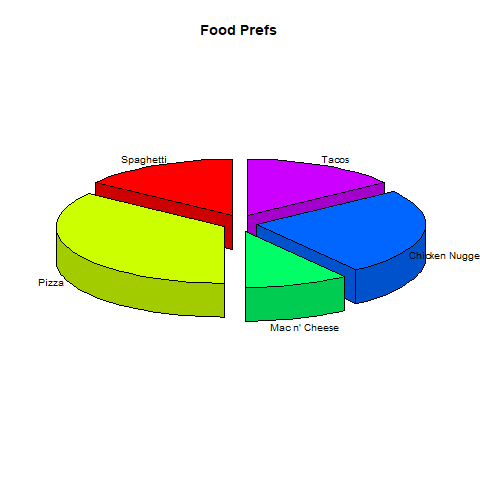

# R Crash Course 

*Based on [this tutorial](https://www.youtube.com/watch?v=s3FozVfd7q4)*

---

## Content:

### 1.  00:40 Installation

- link to go to to download R : https://cran.r-project.org
- go to R for windows -> click on base -> click Download R 3.6.1 for Windows
- Everything default

### 2.  02:14 R Studio Setup 

- Go to https://www.rstudio.com and download the free version of rstudio
- Install R studio and open it. Console, terminal and jobs appears. You can do everything on a console that you can do in the regular R file
- go to file -> new file -> R script .
- go to file -> save as -> save the file in convenient location
- menu bar -> tools -> global options -> left pane's Appearance -> In Editor Theme choose Tomorrow Night to get dark theme. 
- In console type getwd() to get current directory name
- In menu bar -> session -> Set Working Directory go to the folder you have saved your r's file to set your current working directory there. 

    ```bash

    > getwd()
    [1] "C:/Users/intab/OneDrive/Documents"
    > setwd("F:/python/ml-ai-dl/maths/r_crash")
    > getwd()
    [1] "F:/python/ml-ai-dl/maths/r_crash"

    ```

### 3.  04:12 Fun Example 

- A Scatterplot to see if batting average is directly connected to runs produced.

    ```r
    # Load player data
    mlbPlayers = read.table(file=file.choose(),
                        header=T, sep=" ",
                        na.strings="`",
                        stringsAsFactors=F)

    # Grab just RBIs and Avg for each player
    # playerData is known as a data frame (Table of Data)
    # We get the stats we want by passing that list in a vector
    playerData = mlbPlayers[,c("RBI","AVG")]

    # Create the file
    png(file="player_rbi_avg.png")

    # Create the plot
    plot(x=playerData$RBI, y=playerData$AVG,
        xlab="RBI", ylab="AVG", main="RBIs and Average")

    # Create the file
    dev.off()

    ```
- Select the code and click on run. 
- We haven't specified the path to the data file. When we run the above script a browse window dialogue box appears in our working directory. Here we can specify the file that contains data. After running the script playerrbi_avg.png file is created in the working directory. 
- following o/p is produced:


### 4.  09:57 Assignment 

-  You can assign a value using = or <-
    
    ```r

    myNum = 5
    myNum <- 5

    ```

### 5.  10:22 Variables 

- Variable names start with a letter and can contain numbers, underscores and dots

### 6.  10:37 Data Types 

- Most languages use data types to define how much space to set asside in memory, Variables in R are assigned R Objects
- Types are dynamic which means a variable names data type changes based on the data assigned to it
- Here are the Vector types:

    ```r

    # numeric
    print(class(4))

    # integer
    print(class(4L))

    # logical (TRUE, FALSE, T, F)
    print(class(TRUE))

    # complex
    print(class(1 + 4i))

    # character
    print(class("Sample"))

    # raw when converted into raw bytes
    print(class(charToRaw("Sample")))

    ```

- Output in console:

    ```bash

        #numeric
        > print(class(4))
        [1] "numeric"
        > 
        > # integer
        > print(class(4L))
        [1] "integer"
        > 
        > # logical (TRUE, FALSE, T, F)
        > print(class(TRUE))
        [1] "logical"
        > 
        > # complex
        > print(class(1 + 4i))
        [1] "complex"
        > 
        > # character
        > print(class("Sample"))
        [1] "character"
        > 
        > # raw when converted into raw bytes
        > print(class(charToRaw("Sample")))
        [1] "raw"

    ```

- You can check an objects class with is.integer(VAR_NAME), is.numeric(VAR_NAME), is.matrix(VAR_NAME), is.data.frame(VAR_NAME),is.logical(VAR_NAME), is.vector(VAR_NAME), is.character(VAR_NAME)
- You can convert to different classes with as.integer(VAR_NAME), as.numeric(VAR_NAME),...

### 7.  13:33 Arithmetic Operators 

- Usin sprintf we are tyring to print out in console
- Code for addition, subtraction, multiplication, division, modulus and exponent: 

    ```r

    sprintf("4 + 5 = %d", 4 + 5) # %d = integer
    sprintf("4 - 5 = %d", 4 - 5)
    sprintf("4 * 5 = %d", 4 * 5)

    # here we are working with floating values and we have 1 or more value ahead and only 3 after decimal
    sprintf("4 / 5 = %1.3f", 4 / 5) 

    # # Modulus or remainder of division
    sprintf("5 %% 4 = %d", 5 %% 4)
    # 
    # # Value raised to the exponent of the next
    sprintf("4^2 = %d", 4^2) 

    ```

- output in console :

    ```bash

    > sprintf("4 + 5 = %d", 4 + 5) # %d = integer
    [1] "4 + 5 = 9"
    > sprintf("4 - 5 = %d", 4 - 5)
    [1] "4 - 5 = -1"
    > sprintf("4 * 5 = %d", 4 * 5)
    [1] "4 * 5 = 20"
    > 
    > # here we are working with floating values and we have 1 or more value ahead and only 3 after decimal
    > sprintf("4 / 5 = %1.3f", 4 / 5) 
    [1] "4 / 5 = 0.800"
    > 
    > # # Modulus or remainder of division
    > sprintf("5 %% 4 = %d", 5 %% 4)
    [1] "5 % 4 = 1"
    > # 
    > # # Value raised to the exponent of the next
    > sprintf("4^2 = %d", 4^2)
    [1] "4^2 = 16

    ```

### 8.  14:59 Vectors 

- Vectors store multiple values
- Indexing starts at 1

    ```bash

    > # Create a vector
    > numbers = c(3, 2, 0, 1, 8)
    > numbers
    [1] 3 2 0 1 8
    > 
    > # Get value by index
    > numbers[1]
    [1] 3
    > 
    > # Get the number of items
    > length(numbers)
    [1] 5
    > 
    > # Get the last value
    > numbers[length(numbers)]
    [1] 8
    > 
    > # Get everything but an index
    > numbers[-1]
    [1] 2 0 1 8
    > 
    > # Get the 1st 2 values
    > numbers[c(1,2)]
    [1] 3 2
    > 
    > # Get the 2nd and 3rd
    > numbers[2:3]
    [1] 2 0
    > 
    > # Replace a value
    > numbers[5] = 1
    > numbers
    [1] 3 2 0 1 1
    > 
    > # Replace the 4th and 5th with 2
    > numbers[c(4,5)] = 2
    > numbers
    [1] 3 2 0 2 2
    > 
    > # sort values (decreasing can be TRUE or FALSE)
    > # sort(numbers) sorts in increasing direction
    > sort(numbers, decreasing=TRUE)
    [1] 3 2 2 2 0
    > 
    > # Generate a sequence from 1 to 10
    > oneToTen = 1:10
    > oneToTen
    [1]  1  2  3  4  5  6  7  8  9 10
    > 
    > # Sequence from 3 to 27 adding 3 each time
    > add3 = seq(from=3, to=27, by=3)
    > add3
    [1]  3  6  9 12 15 18 21 24 27
    > 
    > # Create 10 evens from 2
    > evens = seq(from=2, by=2, length.out=10)
    > evens
    [1]  2  4  6  8 10 12 14 16 18 20
    > 
    > # Find out if a value is in vector
    > sprintf("4 in evens %s", 4 %in% evens)
    [1] "4 in evens TRUE"
    > 
    > # rep() repeats a value/s x, a number of times and
    > # each defines how many times to repeat each item
    > rep(x=2, times=5, each=2)
    [1] 2 2 2 2 2 2 2 2 2 2
    > 
    > rep(x=c(1,2,3), times=2, each=2)
    [1] 1 1 2 2 3 3 1 1 2 2 3 3
    > 

    ```

### 9.  20:17 Relational Operators

- Consle codes: 

    ```bash

    > iAmTrue = TRUE
    > iAmFalse = FALSE
    > 
    > sprintf("4 == 5 : %s", 4 == 5) # Checking for equality
    [1] "4 == 5 : FALSE"
    > sprintf("4 != 5 : %s", 4 != 5) # not equal to
    [1] "4 != 5 : TRUE"
    > sprintf("4 > 5 : %s", 4 > 5) # gt
    [1] "4 > 5 : FALSE"
    > sprintf("4 < 5 : %s", 4 < 5) # lt
    [1] "4 < 5 : TRUE"
    > sprintf("4 >= 5 : %s", 4 >= 5) # gte
    [1] "4 >= 5 : FALSE"
    > sprintf("4 <= 5 : %s", 4 <= 5) # lte
    [1] "4 <= 5 : TRUE"

    > # Create vector of Trues and Falses depending on condition (is even)
    > isEven = oneTo20 %% 2 == 0 # List with even values 
    > isEven
    [1] FALSE  TRUE FALSE  TRUE FALSE  TRUE FALSE  TRUE FALSE  TRUE FALSE
    [12]  TRUE FALSE  TRUE FALSE  TRUE FALSE  TRUE FALSE  TRUE
    > 
    > # Create array of evens
    > justEvens = oneTo20[oneTo20 %% 2 == 0]
    > justEvens
    [1]  2  4  6  8 10 12 14 16 18 20

    ```


### 10. 22:15 Logical Operators 

- Consle codes: 

    ```bash

    > cat("TRUE && FALSE = ", T && F, "\n")
    TRUE && FALSE =  FALSE 
    > cat("TRUE || FALSE = ", T || F, "\n")
    TRUE || FALSE =  TRUE 
    > cat("!TRUE = ", !T, "\n")
    !TRUE =  FALSE 

    ```

### 11. 23:00 If 

- if, else and else if works like other languages: 

    ```r

    age = 18


    if(age >= 18) {
        print("Drive and Vote")
    } else if (age >= 16){
        print("Drive")
    } else {
        print("Wait")
    }

    ```

### 12. 24:04 Switch 

- Used when you have a limited set of possible values

    ```r


    grade = "Z"

    switch(grade,
        "A" = print("Great"),
        "B" = print("Good"),
        "C" = print("Ok"),
        "D" = print("Bad"),
        "F" = print("Terrible"),
        print("No Such Grade"))

    ```

### 13. 25:34 Strings 

- Indexing is possible and starts at 1.  

    ```bash
    
    > str1 = "This is a string"
    > 
    > # String length, i.e. the number of characters inside string
    > nchar(str1)
    [1] 16
    

    > # You can compare strings where later letters are considered
    > # greater than the earlier letters
    > sprintf("Dog > Egg : %s", "Dog" > "Egg")
    [1] "Dog > Egg : FALSE"
    > sprintf("Dog == Egg : %s", "Dog" == "Egg")
    [1] "Dog == Egg : FALSE"


    > # Combine strings and define sperator if any
    > str2 = paste("Owl", "Bear", sep="")
    > str2
    [1] "OwlBear"

    > # Remove bear from the string
    > substr(x=str2, start=4, stop=7)
    [1] "Bear"

    > # Substitute one string with another
    > sub(pattern="Owl", replacement="Hawk", x=str2)
    [1] "HawkBear"

    > # Substitute all matches
    > gsub(pattern="Egg", replacement="Chicken", x="Egg Egg")
    [1] "Chicken Chicken"

    > # Split string into vector
    > strVect = strsplit("A dog ran fast", " ")
    > 
    > strVect
    [[1]]
    [1] "A"    "dog"  "ran"  "fast"


    ```

### 14. 29:45 Factors 

- Factors are used when you have a limited number of values that are strings or integers

    ```bash

    > # Create a factor vector
    > direction = c("Up", "Down", "Left", "Right", "Left", "Up")
    > factorDir = factor(direction)
    > # Check if it's a Factor
    > is.factor(factorDir)
    [1] TRUE

    > # Any duplication is not going to appear in the levels which is present in the factor objects. Levels stores all possible values
    > factorDir 
    [1] Up    Down  Left  Right Left  Up   
    Levels: Down Left Right Up

    > levels(x=factorDir)
    [1] "Down"  "Left"  "Right" "Up"

    > # You can define your levels and their orders
    > dow = c("Monday", "Tuesday", "Wednesday", "Thursday",
    +         "Friday", "Saturday", "Sunday")

    > wDays = c("Tuesday", "Thursday", "Monday") #work days schedule

    > # create a factor out of wDays specify levels and orders too
    > wdFact = factor(x=wDays, levels=dow, ordered=T)
    > wdFact
    [1] Tuesday  Thursday Monday  
    7 Levels: Monday < Tuesday < Wednesday < Thursday < ... < Sunday

    ```

### 15. 32:15 Data Frames 

- A Data Frame is a table which contains any type of data and an equal amount of data in each column
- Each row is called a record and each column a varaible

    ```bash

    > # Create customer data frame
    > custData = data.frame(name=c("Tom", "Sally", "Sue"),
    +                       age=c(43, 28, 35),
    +                       stringsAsFactors=F)
    > 
    > custData
    name age
    1   Tom  43
    2 Sally  28
    3   Sue  35
    > 


    > # Get data in row 1 column 1
    > custData[1,1]
    [1] "Tom"
    > 


    > # Get all data in 1st row
    > custData[1,1:2]
    name age
    1  Tom  43
    > 


    > # Get all ages
    > custData[1:3, 2]
    [1] 43 28 35
    > 


    > # Get dimensions
    > dim(custData)
    [1] 3 2
    > 


    > # Add another record
    > recordMark = data.frame(name="Mark", age=33)
    > custData = rbind(custData, recordMark)
    > custData
    name age
    1   Tom  43
    2 Sally  28
    3   Sue  35
    4  Mark  33
    > 


    > # Add a column representing debt
    > debt = c(0, 25.50, 36, 48.19)
    > custData = cbind(custData, debt)
    > custData
    name age  debt
    1   Tom  43  0.00
    2 Sally  28 25.50
    3   Sue  35 36.00
    4  Mark  33 48.19
    > 


    > # Check if money is owed
    > owesMoney = custData[custData$debt > 0,]
    > owesMoney
    name age  debt
    2 Sally  28 25.50
    3   Sue  35 36.00
    4  Mark  33 48.19

    ```

### 16. 36:00 Repeat 

- Repeat until a condition is met

    ```r

    num = 1
    repeat{
        print(num)
        num = num + 1
        if(num > 5){
            # Jumps out of loop
            break
        }
    }

    ```

    ```bash
    # o/p in console:
        [1] 1
        [1] 2
        [1] 3
        [1] 4
        [1] 5

    ```

### 17. 36:43 While 

- Repeat while condition is true

    ```r

    while(num > 0){
        num = num - 1 # num is initially 5

        # next skips the rest of the loop and jumps back to the top
        if(num %% 2 == 0){
            next
        }
        print(num)
    }

    ```

    ```bash
    # o/p in console:

        [1] 5
        [1] 3
        [1] 1

    ```


### 18. 37:54 For 

- For can be used to cycle through a vector or do the same thing a specific number of times

    ```r

    oneTo5 = 1:5
    for (i in oneTo5){
    print(i)
    }

    ```

    ```bash

    #o/p:

        [1] 1
        [1] 2
        [1] 3
        [1] 4
        [1] 5

    ```

### 19. 38:43 Matrices 

- A Matrix stores values in rows and columns

    ```bash

    > # Create a Matrix with a single column
    > matrix1 = matrix(data=c(1,2,3,4))
    > matrix1
        [,1]
    [1,]    1
    [2,]    2
    [3,]    3
    [4,]    4


    > # Create a matrix with defined rows and columns
    > matrix2 = matrix(data=c(1,2,3,4), nrow=2, ncol=2)
    > matrix2
        [,1] [,2]
    [1,]    1    3
    [2,]    2    4


    > # You can also fill by row (You can use T or TRUE)
    > matrix3 = matrix(data=c(1,2,3,4), nrow=2, ncol=2, byrow=T)
    > matrix3
        [,1] [,2]
    [1,]    1    2
    [2,]    3    4


    > # Get a Matrix dimension
    > dim(matrix3)
    [1] 2 2

    > # A value at row, column
    > matrix3[1,2]
    [1] 2

    > # Get a whole row
    > matrix3[1,]
    [1] 1 2

    > # Get a whole column
    > matrix3[,2]
    [1] 2 4

    > # Combine vectors to make a Matrix
    > matrix4 = rbind(1:3, 4:6, 7:9) # 1 through 3, 4 through 6, 7 through 9
    > matrix4
        [,1] [,2] [,3]
    [1,]    1    2    3
    [2,]    4    5    6
    [3,]    7    8    9

    > # Get 2nd and 3rd row
    > matrix4[2:3,] 
        [,1] [,2] [,3]
    [1,]    4    5    6
    [2,]    7    8    9

    > # Get 2nd and 3rd row by ommitting the 1st
    > matrix4[-1,]
        [,1] [,2] [,3]
    [1,]    4    5    6
    [2,]    7    8    9
    > 

    > # Change the first value
    > matrix4[1,1] = 0
    > matrix4
        [,1] [,2] [,3]
    [1,]    0    2    3
    [2,]    4    5    6
    [3,]    7    8    9

    > # Change the 1st row
    > matrix4[1,] = c(10,11,12)
    > matrix4
        [,1] [,2] [,3]
    [1,]   10   11   12
    [2,]    4    5    6
    [3,]    7    8    9

    ```

### 20. 43:03 Arrays 

- You can also create Matrices in layers

    ```bash

    > # Create a MULTI-DIMENSIONAL ARRAYS with 2 rows, columns and layers
    > array1 = array(data=1:8, dim=c(2,2,2))
    > array1
    , , 1

        [,1] [,2]
    [1,]    1    3
    [2,]    2    4

    , , 2

        [,1] [,2]
    [1,]    5    7
    [2,]    6    8

    > # Get a value
    > array1[1,2,2]
    [1] 7

    # Experiment grabbing values like we did with the Matrix. Everything is the same

    ```

### 21. 44:22 Functions 

- A function is R is an object that performs operations on passed attributes and then returns results or simply control back

    ```r

    # Create a function
    getSum = function(num1, num2){
        return(num1 + num2)
    }

    ```

    ```bash
    > sprintf("5 + 6 = %d", getSum(5,6))
    [1] "5 + 6 = 11"
    ```


    ```r
    # If there is no return the last expression is returned. You can define default attribute values
    getDifference = function(num1=1, num2=1){
        num1 - num2
    }
    ```

    ```bash
    > sprintf("5 - 6 = %d", getDifference(5,6))
    [1] "5 - 6 = -1"
    ```


    ```r

    # Return multiple values in a list
    makeList = function(theString){
        return (strsplit(theString, " "))
    }

    ```

    ```bash

    > makeList("Random Words")
    [[1]]
    [1] "Random" "Words" 
    ```


    ```r
    # Handling missing arguments
    missFunc = function(x){
        if(missing(x)){
            return("Missing Argument")
        } else {
            return(x)
        }
    }
    ```

    ```bash

    > missFunc()
    [1] "Missing Argument"
    
    ```


    ```r

    # Excepting variable number of arguments with ellipses
    getSumMore = function(...){
        numList = list(...)
        sum = 0
        for(i in numList){
            sum = sum + i
        }
        sum # return sum
    }

    ```

    ```bash
    > getSumMore(1,2,3,4)
    [1] 10
    ```

### 22. 48:44 Anonymous Functions 

- Disposable / Anonymous Functions are great for quick operations like doubling everything in a list

    ```r
    numList = 1:10
    dblList = (function(x) x * 2)(numList)

    ```

    ```bash

    > dblList
    [1]  2  4  6  8 10 12 14 16 18 20

    ```

### 23. 49:29 Closures 

- Closures are functions created by functions
    
    ```r
    # Create a function that finds x to a user defined power
    power = function(exp){
    function(x){
        x ^ exp
    }
    }

    ```

    ```bash

    > cubed = power(3)
    > cubed(2)
    [1] 8
    > cubed(1:5)
    [1]   1   8  27  64 125

    ```


    ```r

    # You can store functions in lists
    addFunc = list(
        add2 = function(x) x + 2,
        add3 = function(x) x + 3
    )

    ```

    ```bash
    # dot operator of Java, C, C++, Python seems to be replaced by $ in R
    > addFunc$add2(5) 
    [1] 7

    ```


### 24. 51:30 Exception Handling 

- Used to gracefully handle errors
- I handle a division with string error

    ```r
    divide = function(num1, num2){
        tryCatch(
            num1 / num2,
            error = function(e) {
                # Check if it is string
                if(is.character(num1) || is.character(num2)){
                    print("Can't Divide with Strings")
                }
            })
    }
    ```

    ```bash

    > divide(10,"5")
    [1] "Can't Divide with Strings"

    ```

### 25. 53:11 File I/O 

- Create a text file with headers fname lname sex
and the data in a txt file Use ` for missing values
- Save in the same directory as your R file
- Supply the file to read, whether the 1st line is headers, what seperates the data, what is being used for missing data and false because you don't want to convert string vectors to factors

    ```bash

    > myPeople = read.table(file=file.choose(),
    +                       header=T, sep=" ",
    +                       na.strings= " \` ",
    +                       stringsAsFactors=F)
    > myPeople
    fname   lname    sex
    1   Andy Brennan   male
    2  Harry  Truman   male
    3   Lucy   Moran female
    4   Dale  Cooper   male
    5 Shelly Johnson female
    6 Audrey   Horne female
    7    Bob    <NA>   male

    > # Add another person
    > donnaRecord = data.frame(fname="Donna",
    +                          lname="Heyward",
    +                          sex="female")
    > myPeople = rbind(myPeople, donnaRecord)

    > # Update a record
    > myPeople[7,2] = "Smith"

    # Update the file by supplying the data.frame, the file to write, seperator, na whether to quote strings, whether to include row numbers
    > write.table(x=myPeople, file=file.choose(),
    +             sep=" ", na="\`",
    +             quote=F, row.names=F)
    # Dialogue box appears to choose a file to write in 

    > # Get 1st 3 records
    > head(myPeople, 3)
    fname   lname    sex
    1  Andy Brennan   male
    2 Harry  Truman   male
    3  Lucy   Moran female

    > # Get remaining records
    > tail(myPeople)
    fname   lname    sex
    3   Lucy   Moran female
    4   Dale  Cooper   male
    5 Shelly Johnson female
    6 Audrey   Horne female
    7    Bob   Smith   male
    8  Donna Heyward female

    ```

### 26. 58:29 Plotting 

-  R provides great plotting tools
- Point plot:
    ```bash

    # Plotting x y coordinates from a matrix
    # 1st 5 are x and 2nd 5 are y
    xy1 = matrix(data=c(1,2,3,4,5,
                        1,2,3,4,5), nrow=5, ncol=5)
    plot(xy1)
    ```
- Output plot:

    

- Line Plot:
    ```bash
    > # Draw a line
    > x2 = c(1,2,3,4,5)
    > y2 = c(1,2,3,4,5)
    > plot(x2, y2, type="l")
    ```
- Output plot:

    

- Points and lines:
    ```bash
    > # Points and lines
    > plot(x2, y2, type="b")
    ```
- Output plot:

    

- Point and lines with no space around points. Line is formatted with color
    ```bash
    > # Points and lines with no space around points,
    > # labels, a blue line (Find more with colors() in console)
    > plot(x2, y2, type="o",
    +      main="My Plot", xlab="x axis", ylab="y axis",
    +      col="steelblue")
    ```
- Output plot:

    

- Weird plot:
    ```bash
    #----WEIRD PLOT-----
    > # pch (1-25) defines different points
    > # lty (1-6) defines different lines
    > # xlim defines the max and min x plotting region
    > # ylim defines the max and min y plotting region
    > plot(x2, y2, type="b", pch=2, lty=2,
    +      main="My Plot", xlab="x axis", ylab="y axis",
    +      xlim=c(-8,8), ylim=c(-8,8))
    ```
- Output plot:

    

- Multiple Plots
    ```bash
    > #----- Multiple plots-----
    > plot(x2, y2, type="b")
    > # Multiple plots
    > plot(x2, y2, type="b")
    >
    > # Adds straight lines at 2 and 4 coordinates
    > abline(h=c(2,4), col="red",lty=2)
    > # Multiple plots
    > plot(x2, y2, type="b")
    >
    > # Adds straight lines at 2 and 4 coordinates
    > abline(h=c(2,4), col="red",lty=2)
    > 
    > # Draw a 2 segmented lines with starting and ending x
    > # and y points
    > segments(x0=c(2,4), y0=c(2,2), x1=c(2,4), y1=c(4,4),
    +          col="red",lty=2)
    >
    > # Draw an arrow
    > arrows(x0=1.5, y0=4.55, x1=2.7, y1=3.3, col="blue")
    > 
    > # Print Text
    > text(x=1.25, y=4.75, labels="Center")
    ```
- Output plot:

    

- Load Builtin
    ```bash
    > # -----Load a built in data.frame-----
    > plot(faithful)
    ```
- Output plot:

    

- Highlight eruptions:
    ```bash
    > # Highlight eruptions with a waiting time greater than 4
    > eruptions4 = with(faithful, faithful[eruptions > 4,])
    >
    # Draw specific points
    points(eruptions4, col="red", pch=3)
- Output plot:

    
    ```

### 27. 1:08:14 Math Functions 
- Some math functions :
    ```bash
    > sqrt(x=100)
    [1] 10
    > 
    > # Get the power you raise the base to get x
    > log(x=4, base=2)
    [1] 2
    > 
    > # Euler's number 2.718 to the power of x
    > exp(x=2)
    [1] 7.389056
    > 
    > # Sum all vector values
    > sum(c(1,2,3))
    [1] 6
    > 
    > # Find the mean (average)
    > randD1 = c(1,5,6,7,10,16)
    > mean(randD1)
    [1] 7.5
    > 
    > # The median (Middle Number or avg of middle 2)
    > median(randD1)
    [1] 6.5
    > 
    > # Minimum value
    > min(randD1)
    [1] 1
    > 
    > # Maximum value
    > max(randD1)
    [1] 16
    > 
    > # Min and max
    > range(randD1)
    [1]  1 16
    > 
    > # Rounding
    > ceiling(4.5)
    [1] 5
    > floor(4.5)
    [1] 4
    > 
    > # Cumulatives
    > cumsum(c(1,2,3))
    [1] 1 3 6
    > cumprod(c(1,2,3))
    [1] 1 2 6
    > cummax(c(7:9, 4:6, 1:3))
    [1] 7 8 9 9 9 9 9 9 9
    > cummin(c(4:6, 1:3, 7:9))
    [1] 4 4 4 1 1 1 1 1 1
    > 
    ```
### 28. 1:11:18 Random Numbers
-  Generating Random samples

    ```bash
        > # Flipping a coin 10 times and weigh the probability
        > # of the next flip based on the previous
        > sample(0:1,10,replace=T)
        [1] 0 0 0 1 0 1 1 1 1 0
        > 
        > sample(1:20,10,replace=T)
        [1] 15 15  8 10  6  9  8  3  3 20
    ```
### 29. 1:12:18 Pie Charts 

- Follow the code with percentage and item required to form a pie chart: 

    ```r
    # List percentages
    foodPref = c(15, 35, 10, 25, 15)
    # Labels associated with percentages
    foodLabels = c("Spaghetti", "Pizza", "Mac n' Cheese",
                "Chicken Nuggets", "Tacos")

    # Where to save the image
    png(file="child_food_pref.png")

    # Colors used for each option
    colors = rainbow(length(foodPref))

    # Create the chart
    pie(foodPref, foodLabels, main="Food Prefs",
        col=colors)

    # Print legend and cex shrinks the size
    legend("topright", c("Spaghetti", "Pizza", "Mac n' Cheese",
                        "Chicken", "Tacos"), cex=0.8,
        fill=colors)

    # Save the chart
    dev.off()
    ```
- Output plot:

    
- You have to download a package for 3d pie charts.
- Go to console and type the following:

    ```bash
    > install.packages("plotrix")
    WARNING: Rtools is required to build R packages but is not currently installed. Please download and install the appropriate version of Rtools before proceeding:

    https://cran.rstudio.com/bin/windows/Rtools/
    Installing package into ‘C:/Users/intab/OneDrive/Documents/R/win-library/3.6’
    (as ‘lib’ is unspecified)
    trying URL 'https://cran.rstudio.com/bin/windows/contrib/3.6/plotrix_3.7-6.zip'
    Content type 'application/zip' length 1146848 bytes (1.1 MB)
    downloaded 1.1 MB

    package ‘plotrix’ successfully unpacked and MD5 sums checked

    The downloaded binary packages are in
        C:\Users\intab\AppData\Local\Temp\Rtmp6RoFqJ\downloaded_packages

    ```
- Code for 3D pie charts:

    ```r
    # 3D Pie Chart
    # Download package in console install.packages("plotrix")
    # Get the library
    library(plotrix)

    # Name the chart file
    png(file="3d_child_food_pref.png")

    # Create the chart
    pie3D(foodPref, labels=foodLabels, explode=0.1,
        start=pi/2, main="Food Prefs", labelcex=0.8)

    # Save the chart
    dev.off()
    ```
- Output plot:

    
### 30. 1:17:56 Bar Charts 

- Define the bar chart file

    ```r
    png(file="food_pref_bar_chart.png")
    # Plot the chart
    barplot(foodPref, names.arg=foodLabels, xlab="Votes",
            ylab="Food Options", col=colors,
            main="Food Prefs")
    # Save File
    dev.off()
    ```
- Output plot:

    
### 31. 1:20:12 Regression Analysis

- Used to study a relationship between 2 separate pieces of data (What is the relation between batting average and RBIS)

    ```r
    #pulling in the data
    mlbPlayers = read.table(file=file.choose(),
                            header=T, sep=" ",
                            na.strings="`",
                            stringsAsFactors=F)

    #Calculate the average and RBI out of the data
    playerData = mlbPlayers[,c("RBI","AVG")]

    # Create relationship model between AVG and RBIs
    relation = lm(playerData$RBI~playerData$AVG)

    # Create file
    png(file="RBI_AVG_Regression.png")

    # Plot the chart
    plot(playerData$AVG, playerData$RBI,
        main="AVG & RBI Regression",
        abline(lm(playerData$RBI~playerData$AVG)),
        xlab="AVG", ylab="RBIs")

    # Save chart
    dev.off()

    ```
- Output Plot:

    
### 32. Bonus (Multiple Regression)

- Used to study the impact on one variable from numerous others

    ```r

    # Estimate RBIs based on other player stats
    playerData2 = mlbPlayers[,c("RBI","AVG","HR","OBP",
                                "SLG","OPS")]

    # Create the relationship model
    relation2 = lm(playerData2$RBI ~ playerData2$AVG +
                    playerData2$HR + playerData2$OBP +
                    playerData2$SLG + playerData2$OPS)

    sprintf("Intercept : %f1.4", coef(relation2)[1])

    # How stats effect RBIs
    sprintf("AVG : %f1.4", coef(relation2)[2])
    sprintf("HR : %f1.4", coef(relation2)[3])
    sprintf("OBP : %f1.4", coef(relation2)[4])
    sprintf("SLG : %f1.4", coef(relation2)[5])
    sprintf("OPS : %f1.4", coef(relation2)[6])

    # Calculate expected RBIs based on stats
    # Evan Longoria
    # RBIs   AVG   HR   OBP   SLG   OPS
    # 86     .261  20  .313  .424  .737
    RBIGuess = -5.05 + (372.96 * .261) + (2.56 * 20) +
    (-5.41 * .313) + (-167.37 * .424)
    RBIGuess

    ```

    ```bash
    > RBIGuess
    [1] 70.83435
    ```